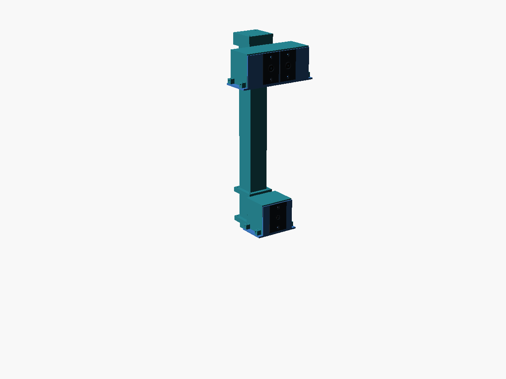
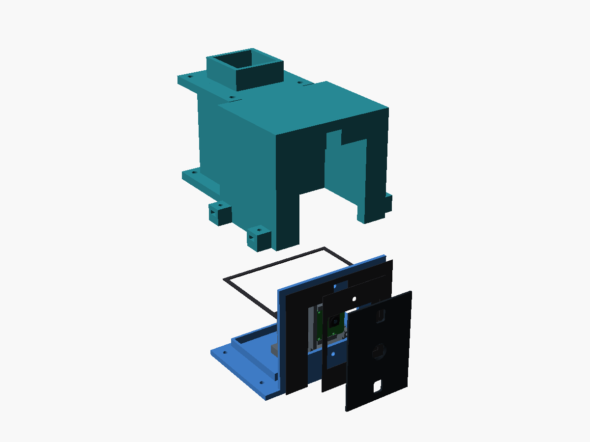
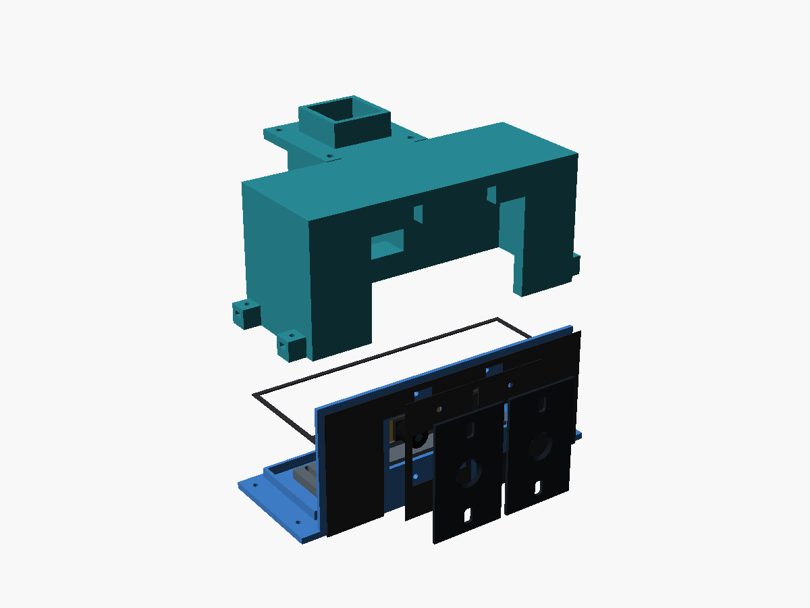

# Installation guide — printed mounts on the Toro TimeCutter conversion

Where each printed part goes, how it is fastened, and what to check before the next step.
Read `README.md` first for the dimensional evidence and the print inventory.

**Colour legend for every `view_*.png`:** teal = printed part · silver = steel hardware ·
grey = machine structure (schematic) · amber = reserved envelope or placeholder ·
red/yellow = E-stop mushroom · blue = removable cover / tray.

**The mower and hitch plate are not modeled.** Grey body and hitch-plate envelopes, lap bars and motor
positions are placeholders. The layer/arms/clamp/rods are CAD parts, but their relation to the mower is
illustrative until each hole, plate edge, bar diameter, motor shaft and neutral/PARK pin location is
measured on the actual machine.

Regenerate all views and parts with `python3 hardware/mounts/build_printables.py`.

---

## 0. Before touching the mower

- Engine off, key out, spark-plug lead off, battery negative disconnected, blade off, levers in PARK,
  wheels chocked, on level ground. Keep all tests unpowered.
- Identify mower serial/manual, determine whether the operator platform moves relative to the chassis,
  and locate both lap-bar pivots. If the seat/platform and pivots move relative to the arm-mounted
  servos, stop: this fixed-frame layout does not accommodate that motion.
- Measure the hitch hole, plate width/depth/thickness and surrounding edges, and each lap-bar tube
  OD. For the Toro 77502 rods, take the clamp-point, crank and travel measurements in
  `TORO_77502_LINKAGE.md`; the default rods are an estimate.

## 1. Coupons and machine measurements

| Coupon | Hold it against | Pass condition |
|---|---|---|
| `hitch_gauge` | Actual mower hitch bolt/hole | Mates without force; set enclosure `hitch_hole_d` from measurement |
| `arm_layer_gauge` | Enclosure tongue centre/auxiliary-hole pattern | All three holes align with the enclosure only; does not validate mower-plate anti-rotation |
| `fit_gauge_1` | E-stop rail and square U-bolt | Actual rail and bolt match the assumed window/pitch |
| `fit_gauge_2` | RDS51150SG stationary-holder side | Six M2.5 screws pass its photo-derived slots and Ø13.5 opening |
| `lapbar_clamp_insert_0`–`_4` | Actual steering-bar tube | Sleeve set spanning 20 / 22.2 / 25.4 / 28.6 / 30 mm bar OD. The sleeve that slips over the bar is the one to fit; the clamp halves do not change with the bar |
| `pushrod_gauge_0`–`_2` | 40 mm sleeve and 29.1 mm inner bar | Inner bar slides without binding at the chosen fit |

Measure the real hitch plate edges and edit `hitch_plate_width_mm`, depth and thickness in
`enclosure_common.scad` before printing the layer. Arm roots start 2 mm outboard of the schematic
plate edge; a wider plate may exceed the side-ear bolt land and intentionally fail the layer assert.
Measure each lap-bar clamp point and crank before changing `lapbar_pin_*`/`servo_crank_r`; never print
rods from the default estimate without that check.
rods from the default estimate without that check.

---

## 2. Sandwich layer and outboard servo arms

**Parts:** `arm_layer_center` × 1, `arm_layer_left/right` × 1 each, `arm_head_left/right` × 1 each,
`arm_brace_bar_left_0/1/2` and `arm_brace_bar_right_0/1/2` × 1 each, eight M6 root bolts/nuts and washers,
eight M6 head-joint bolts/nuts, twelve M5 pad bolts/nuts, twelve short M4 jaw screws/nuts,
eight M2.5 servo screws/nuts, plus the `hitch_gauge` and `arm_layer_gauge` coupons.

Each 60 × 70 mm solid root seats on the **top** of its sandwich-layer ear at z=0. Four
vertical M6 bolts enter from the free underside of the 8 mm ear and terminate in
side-entry captive nut slots in the root at z=16–22.5. The hollow 50 × 70 mm column
rises from that root, splayed 12.58° from vertical. Its two Ø8 side vents near
the root must remain open to both channel lobes, not sealed by paint or adhesive.
The measured servo face stays 209.55 mm from the ball-hole centre at z≈430 mm.
The lower arm's joint is at local t=355 mm; the head bolts to it through the
flanged, spigoted four-M6 lap. The holder face stays lateral.

**Sway bars are not steering-load parts.** Three per side land on arm pads at assembly
z=110/190/250 mm. The first fits beside the camera tower base webs below its joint;
the upper two fit above the first segment's bottom flange. Each handed bar has a
half-jaw; the left/right pair forms a rear-open U with a 0.4 mm centre gap, rather
than two full jaws occupying the same space. Fit from **+Y toward the box** after
tower assembly. Two short M4 screws per half thread into top-loaded steel nuts
and bear **outside** the tube, never through its USB-cable wall. Each pad has side-entry M5 nut
slots and two matching bar bores. The faces have 0.2 mm nominal print clearance;
clamp them squarely without forcing. Jaw slip, pad cracking or nut pullout is a
stop-work condition. No powered-steering strength qualification is implied.

Print each handed brace in its exported orientation. Its jaw touches the bed but
the broad web/end land sit above it: **supports are required under the raised web,
end land and jaw overhangs**. Do not stand the web upright to avoid supports; inspect
the slicer layers and keep all steel-nut entry slots clear.

The assembly images use a **160 × 120 × 8 mm schematic hitch plate**. Measure the actual hole,
plate outline and thickness first; set `hitch_hole_d`, `hitch_plate_width_mm`,
`hitch_plate_depth_mm` and `hitch_plate_t_mm` in `enclosure_common.scad`. The center
layer's 20.8 mm hole is provisional. Its 42 mm ears put the root bolt washers inside
the printable layer without moving the measured servo station.

1. Offer the tongue/layer/plate stack together with box, glands, tower feet and cables.
   Check the added 8 mm layer against actual fastener engagement and hitch hardware.
2. Align the center hitch hole. Reuse OEM hardware only if its thread, engagement,
   washer and rating permit the added thickness; do not invent a torque.
3. Slide four **steel M6 nuts per root** into the side slots, then place the feet on
   the layer **top**. Insert four M6 bolts per arm upward from beneath the side ears
   into those nuts; inspect all eight accessible seats and confirm no part enters
   the mower plate. Fit both heads, seating each spigot with four M6 flange bolts.
   Verify that both flange faces seat fully with the spigots located; do not use bolt
   preload to pull a floating head into place or crush a shallow/obstructed pocket.
4. Assemble the camera tower first. Insert each pad's two M5 nuts from its +Y edge.
   Drop two M4 nuts into each half-jaw's top slots; use the labelled left/right
   STLs and offer both halves from **+Y** at z=110/190/250. Never slide over a flange.
   With the pad and bar parallel, pass two M5 bolts through the bar into the
   side-loaded pad nuts, then tighten the M4 screws only until the jaw is secure
   against the tube. Do not drill or enter the USB cable bore; hand-cycle and
   bench-load for slip and creep before any powered test.
5. **Stationary rear bracket:** each arm head's lateral land has six photo-derived
   Ø2.9 slots (cutter-centre ±0.4 mm Y/Z) and a Ø13.5 rear opening, running through the
   whole rib. Insert six M2.5 steel through-bolts from the **outboard (bracket) side**;
   put an OD6 × 1 washer and AF5 × 2.5 nut on the exposed flat **inboard X=0 face** and
   turn them with a slim (≤Ø8) socket from −X. No nut pocket inside the rib. Prove the
   pattern with `fit_gauge_2` on the purchased servo before printing heads.
6. **Moving crossplate adapter:** `servo_adapter_right`/`_left` bolts to the broad eight-hole
   U crossplate (the moving member, not the disc) with eight M2.5 through-bolts and broad
   12 mm **metal** washers/nuts; the slotted passages allow the adapter to centre on the
   photo-fitted pattern. Check the plate with `servo_adapter_gauge` first. The adapter's
   12 mm clevis ears carry the 8 mm rod eye on an M6 pin in **double shear**; never thread
   a printed ear. Face angle **45° = neutral** (levers centred), **90° = full reverse**.
   Clocking witness: the pad has a centre line and a 45° tangent mark. With the rod pin
   removed and levers hand-set to neutral, rotate the output until the crossplate face is
   at 45°, bolt the adapter so the witness line points straight up and the pin bore sits
   plumb above the shaft, mark the spline/plate together, hand-move to full reverse and
   confirm the face reaches 90° without contact. Electrical command direction is calibrated
   separately per motor; these angles are **not PWM values**.
7. **Torque restraint remains a stop-work gate.** Auxiliary layer holes at x=±40
   are only candidate locations; the actual hitch plate has not been shown to

## 3. Four-bolt lap-bar connectors

**Parts:** `lapbar_clamp_anchor` + `lapbar_clamp_cap` for each side (Ø36.4 bore, independent of the bar),
the sleeve set (`lapbar_clamp_insert_0`–`_4`, spanning 20–30 mm bar OD), and four M5 bolts with broad
washers and locking nuts per clamp. **No calipers needed**: try the sleeves on the bar, keep the size that
slips on, and print two more per side of that size — the clamp halves themselves are printed once and never
change with the bar. Slide each half-sleeve into its clamp half before closing the clamp on the bar; the
sleeve flanges must seat against the clamp's end faces.
Each half carries one thick printed yoke ear. Together the ears straddle the rod's single 8 mm-thick
eye lug across a 9 mm gap; a removable M6 ×55 bolt passes through ear-eye-ear in double shear. The
42 mm yoke span/reach clears the 32 ×20 mm eye through its modeled planar sweep. The rod stays
8 ×20 mm through an 8 mm neck beyond the eye root, then tapers over 20 mm into the 29.1 mm inner
bar. That keeps the bar outside the ear envelope. Geometry only; not strength
qualification.

Position each clamp only after confirming it will not obstruct lever grip, pivot sweep, PARK, seat,
tyres, belts, lines or deck lift. Align the yoke pin axis to the rod eye; do not force a tilted pin into
place. Clamp preload, printed-material creep and bar-surface friction remain unqualified. Hand-test
slip and inspect for whitening/cracks before any powered test.

## 4. Positively locked rods

**Parts per side:** `pushrod_servo_end`, `pushrod_middle_a`, `pushrod_middle_b`, `pushrod_sleeve` and `pushrod_inner`
(print two sets; the left rod is the same set turned 180° about its own axis). Hardware per rod:
four M6 ×55 splice bolts, two M6 ×55 lock bolts, one M6 ×55 clamp-yoke pin, and one M6 ×35–40
adapter clevis pin (spans the 6 + 12 + 6 mm ear-gap-ear grip plus washers and a lock nut; verify
actual stack), each with washers and a locking nut. Verify actual stacks before ordering.
The 40 mm square tube has 5 mm walls; the 29.1 mm inner bar slides with 0.45 mm clearance per side.

The default **936.4 mm** pin length is the Toro TimeCutter MAX 50 in MyRIDE estimate in
`TORO_77502_LINKAGE.md`, not a measurement. The three lock settings give 921.4/936.4/951.4 mm.
The rod length is set on the bench by choosing a joint position; set the clamp-pin and crank
values in `enclosure_common.scad` only if the estimated band turns out to be wrong.

1. Select the loose/nominal/tight square-fit coupon. Join the four outer pieces spigot-first with
   two M6 bolts per splice. Both lock bolts must pass through the sleeve and the matching inner-bar
   holes at one setting. Friction alone is not the lock.
2. Fit the servo crank **up** at neutral, square to a level rod. The servo-end eye sits in the
   printed adapter's 12 mm clevis gap (2 mm shim/trim space each side of the 8 mm eye) on the
   M6 pin in double shear. Fit the inner eye between the clamp's paired yoke ears (9 mm gap).
   Both bores are Ø6.6 mm. Changing one lock step moves the servo eye about 1.1 mm along its pin;
   correct it with shims inside the clevis gap.
3. Both pin axes must stay parallel to the mower's left-right axis. The rod's 4.12° skew carries the
   lap bar's extra outboard offset; it does not permit out-of-plane articulation. Do not bend the
   clamp, force a tilted pin, or use loose pins to hide a mismatch.
4. With servos unpowered, hand-cycle the 45° neutral face, the 90° full-reverse face and outboard
   PARK. Remove a pin to verify manual release. Any binding, slip, interference or failure to
   self-centre is a stop-work condition; do not compensate with force.
5. While someone rides normally, check that the MyRIDE platform does not move the clamp pins
   fore-and-aft relative to the hitch plate. Such motion becomes an unintended lever command.
6. Route both rods clear of the engine, muffler, belts and seat platform. ASA must stay well away
   from exhaust heat.

The 12 V stall rating is 165 kg·cm (about 16.2 N·m): roughly 295 N at the 55 mm adapter pin
radius. That is a hazard/load estimate, **not** a permitted operating force and not proof for any
printed part or mower mounting. No material fatigue/creep, impact, root-bolt, clamp-slip or
hitch-plate qualification is claimed.
## 5. E-stop

**Parts:** `estop_bracket`, `estop_contact_cover`, 2 square U-bolts + backing/washers/nuts, 4 M3 × 12 +
nuts + washers for the cover, the HB2-ES545 switch with its own retaining ring.

**Where:** on a frame rail at the **rear or side of the machine**, mushroom facing outward, at a height
you can hit with a palm **standing on the ground, without reaching over the deck or into the operator
station**. Not on the deck, not where knees or thrown debris hit it, not where you would lean on it to
climb on. Verify by walking up to the parked mower and hitting it without leaning in.

**Install:** switch through the Ø22.5 bore, retained by its own ring. Wire it. Four M3 nuts drop into
the cover's pockets from the open face; cover over the contacts, screws from the bracket side. Wire
opening faces **down**; tie the cable to the cover slots with a drip loop below. U-bolts as in step 2.
The cover keeps fingers and grass off the terminals; it is not a sealed housing.

## 6. Enclosure, sandwich layer and hitch plate

The box/tongue is held between the **measured mower hitch plate** and
`arm_layer_center`. The center panel has 42 mm ears with roots seated on top
and M6 bolts entering from the free underside. The hitch plate in the views
is schematic, not a Toro drawing. Complete §0/§1 measurements and §2 mock-up
before committing to a full box or powering steering.

**Stack and sequence:**

1. Fit glands/breather in the body; confirm their locknuts clear the layer's 24 mm pass-throughs.
2. Fit the electronics tray and seal its four floor bolts; choose bolts long enough for the added
   8 mm layer and check nut/thread engagement.
3. Fit the Pi, boards, insulating spacers and sleds. Drill only the actual PCB patterns.
4. Fit the camera-tower wall flange, backing strip and foot. Its M5 foot bolts also pass the layer;
   check their grip length with the extra 8 mm.
5. Fit the 3 mm seal cord, lid and twelve M4 fasteners.
6. Place the center layer under the box flange and integral tongue; align the ball-hole and auxiliary
   holes only if measured. Set the stack on the hitch plate and install correctly rated/length hardware
   using the mower's specified hitch-bolt torque.
7. Re-check the plate edges against the arm roots; verify a positive anti-rotation connection into
   the actual plate/chassis. The auxiliary tongue holes alone only join the box and printed adapter;
   if the plate has no matching holes, do not mistake them for torque restraint.

**Stop-work gate:** no positive hitch anti-rotation path is established in the model. The central
ball-hole fastener alone is not approved for powered steering or rough-ground use. Confirm ground,
reverse/trailer clearance, mounting strength, tower vibration, and all OEM interlocks on the actual
mower. A bridge across a suspended operator platform is not acceptable unless actuator and pivot
move together.

## 7. Camera tower

### Parts and height

Print one `camera_tower_base`, N `camera_tower_segment` parts, one `camera_tower_backing` drilling
template, one `camera_tower_extension` and one `camera_tower_cap`. Print one each of
`camera_pi_housing`, `camera_pi_bottom`, `camera_pi_carrier`, `camera_pi_retainer`,
`camera_stereo_housing`, `camera_stereo_bottom`, `camera_stereo_carrier`,
`camera_stereo_retainer`. Also print lens inserts and gaskets per station: `camera_pi_lens_insert`,
`camera_pi_face_gasket`, `camera_pi_floor_gasket`, `camera_pi_insert_gasket`,
`camera_pi_rim_gasket`, plus `camera_stereo_lens_insert_left`, `camera_stereo_lens_insert_right`,
`camera_stereo_face_gasket`, `camera_stereo_floor_gasket`, `camera_stereo_insert_gasket_left`,
`camera_stereo_insert_gasket_right`, `camera_stereo_rim_gasket_left`, `camera_stereo_rim_gasket_right`.
The old exposed camera carrier, stereo clamp bracket, **four `camera_stereo_clip` parts, and
nonprinted panes are not part of this stack**.

Supply a measured ≥2 mm metal backing strip, six M5 wall bolts/nuts, two M5 foot bolts through
foot/tongue/8 mm sandwich layer, and four M4 bolts/nuts at each flange joint. Select bolt lengths
from actual grip and nut engagement. Each camera needs four M3 tray screws/nuts, two M3 cassette
bolts, and two M2 retainer through-bolts/nuts; each lens insert needs two M3 bolts with **20 mm OD**
metal plus compliant sealing washers. Neither camera uses a tilt foot.

**No nonprinted panes are supplied or used.** The closing face is opaque and integral to the tray.
Each lens looks through its own round flared aperture in a printed insert. Measure the actual SVPRO
PCB, lens projection and component clearances before fitting; **no stereo baseline is assumed**.

Set `tower_height` in `enclosure_common.scad` to the required **lower Pi lens-centre datum**
(default 900 mm), based on your seated sightline. Segment count and length derive from that datum.
The order is lower mast → **80 mm Pi housing → 304.8 mm extension → 80 mm stereo housing → closed
terminal cap**. Optical centres are **384.8 mm apart**, not 304.8 mm. Both face −Y.

### Print and structural limits

Print the base flange-down with support beneath the horizontal column/joint as needed. Print mast
segments and the extension lying on a tube face, not standing upright. Use the exported cap/backing
orientations. Inspect bridge quality, nut-pocket access, spigot fits and unobstructed cable paths.
Housing/tray/carrier exports use their dedicated print orientations; do not print assembly scenes.

The previous **3.7 MPa / FOS 11 / cross-layer FOS 2.9** estimates do **not** apply to the added
height and mass. No stress, fatigue or vibration margin is qualified for this tower. Physically
validate mounting strength and engine-speed vibration before operation, and inspect joints regularly.

### Install the mast and cable route

1. With the box open, put the metal backing strip inside the +Y wall and the base flange outside.
   Fit six M5 wall bolts and two M5 foot bolts through the tongue and sandwich layer.
2. Thread the stereo USB-A connector through the mast/base/box **before fitting camera
   cassettes, lens inserts or deck payloads**; the connector route is not through installed PCBs.
   Route the Pi CSI cable before loading its cassette as well. The mast has a **32.2 mm square minimum throat**;
   each housing rear port and the base/box entry are **30 × 50 mm**. The design uses a
   **24 × 14 × 45 mm connector gauge** and an elevated 90° base bend through the closed duct's
   flared relief, above the M4 brace shafts at z=110 mm. This bend includes installed brace bolts
   in the geometric gate, which passed in the full CAD build. Check the real plug and respect cable
   bend radii: capacity for this gauge does not guarantee every USB overmould fits.
3. Seat each lower segment's socket over the preceding spigot without force and bolt each flange
   joint with four M4 bolts/nuts. Install the **lower Pi shell first**, then the **304.8 mm extension**,
   then the **upper stereo shell**, then the closed cap. Fasten every flange joint. The cap has
   neither a camera-foot fixing nor a side cable slit.
4. Thread each camera cable through its rear housing port into the mast before inserting its
   carrier. Leave controlled service slack without fouling the optical bay or blocking the bore.
   Route the flexible base cable into the box near **z=122 mm within the closed duct**, and restrain
   it clear of bolt shafts. Keep the upper-column cable centred between the y=±14 mm brace bolts.
   This initial threading order does not change bottom-tray servicing with the mast installed.
5. After connector threading, seal **every mast flange joint** with a removable gasket or compatible
   sealant; a closed roof and seated spigots do not seal the flange water path. The extension is
   **304.8 mm printed flange-to-flange**; compressed gasket thickness adds to actual stack height.
   Seal the rectangular box entry using a split gasket or compatible sealant. Keep the base sump
   drain and separate lower web-pocket weep vent clear; do not seal water into the column.

Camera Module 2 is **CSI, not USB**. Pi 5 needs a compatible **22-to-15-pin camera cable/extension**.
A passive approximately 1 m CSI run is not proven reliable: demonstrate installed signal integrity
or use a suitable active CSI extender with verified compatibility, power and environmental protection.
The stereo camera uses USB. Geometric clearance is not electrical qualification.

### Load and service each camera from below

1. **Bench load the cassette.** Slide the PCB from +X into the cassette's shallow top/bottom edge
   grooves toward the fixed left stop; never bend a populated board over a lip. The grooves hold a
   **3.2 mm maximum PCB + pad stack** with **0.8 mm edge engagement**; fill the gap for the real
   board from the groove-pad kit (0.4–2.4 mm) or thin insulating compliant tape, then screw on the
   removable right-edge retainer with two M2 through-bolts and nuts. Pi contact spans x −13.6…3 mm;
   the middle of its CSI edge stays open behind a rear-bridged retainer with 12 mm chosen connector
   clearance. Stereo's 24 mm upper-centre gap clears its 9 mm USB-C connector. Confirm on the
   actual board that those narrow lands are free of components.
2. Bolt the cassette to the tray through its two fore/aft M3 slots. The slots give **Pi −11.8…+10 mm**
   and **stereo −8…+10 mm** board travel, so the board front can sit at y −107.8…−86 (Pi) or
   −104…−86 (stereo). Set it from the actual lens projection; the 2.2–24 mm (Pi) and 7–25 mm (stereo)
   projection ranges are **capacities**, not measurements.
3. Lay the floor gasket in the tray recess and lift the tray + cassette straight **up (+Z)** through
   the shell's bottom-open broad PCB/lens key and narrow upper-nut keys. Retain it with the four
   original M3 bottom fixings into side-access steel nuts.
4. **Fit the lens inserts from the front**, along +Y, each over its face gasket and insert gasket,
   with its rim gasket on the lens's non-optical rim. Never sweep a closed round hole vertically
   across a protruding lens, and never press on the glass. Two M3 bolts per insert, each with a
   **20 mm OD** metal plus compliant sealing washer. Inserts may stay fitted for later bottom
   servicing, because the camera, closing face and inserts travel together.

**Choosing a bore and centre.** Offer the real lens to `camera_<kind>_lens_gauge` and choose the smallest
loose bore (prototype default Pi Ø8, stereo Ø14). Set `camera_insert_bore_mm`, then try the opaque
tiles in `camera_<kind>_tile_fit_kit` with the lens behind them, using the actual camera as the
jig. Enter the winning coarse offset (`camera_insert_offset_x_mm`/`_z_mm` for Pi;
`camera_stereo_lens_offsets_mm = [[left_dx,left_dz],[right_dx,right_dz]]` for stereo) and rebuild;
fine slot travel closes the 2 mm gaps between tiles. An assert refuses any bore/offset whose aperture,
front flare and full fine travel would leave the opaque port window (centre capacity =
window edge + bore/2 + thickness × tan(FOV/2) + 0.5 mm). For the defaults that is Pi x −15.2…15.2,
z 26.8…53.2 mm and stereo x ±(15.3…33.7), z 33.3…46.7 mm: **capacities, not a measured stereo
baseline or lens position**.

For service, release cable strain, remove the four bottom M3 fixings and lower the whole service set
straight down **without removing the mast or shell**. Gaskets are TPU solids or foam cutting templates
and need compliant stock, preload or adhesive as appropriate.

The roof/hood and seals do not establish an IP rating, rain-tightness or fog resistance. Keep
sealant removable at service joints and qualify ingress, condensation, vibration and optical performance
physically. The 110° (Pi) and 85° (stereo) per-lens cones are design capacities for the insert flare,
not camera calibration.

## 8. Camera, sensors, antenna

For the enclosed cameras, use the bottom-loading steps and exploded views in §7.

| Part | Where | Notes |
|---|---|---|
| `camera_pi_housing` / `camera_stereo_housing` | Pi at the lower station; stereo above the 12-inch extension | Bottom-loaded tray/cassette/retainer/inserts, gaskets, service screws (§7). CSI for Pi; USB for stereo. |
| `sensor_carrier` (+ `camera_foot` if tilt is appropriate) | ToF: front corners, aimed forward, apertures unobstructed. BME280: shaded, ventilated, away from exhaust. IMU: rigid on the chassis near the middle of the machine, away from servos and high-current wiring. INA3221: inside the enclosure on a utility sled | Blank carrier: drill for the real board, board on insulating spacers, then fix the carrier |
| `antenna_deck` | Highest practical point with a clear sky view — behind/above the seat or on a mast | Strap the antenna through the edge slots; add a ≥100 mm metal ground plane under a patch antenna. Keep the RTK antenna away from the engine ignition lead |

## 9. Cables

- Frame cables enter through glands from below with drip loops. The mast route instead uses the
  rectangular port sealed with a split gasket after threading (§7); keep its sump drain clear.
- `harness_saddle` every ~300 mm along the frame and at every change of direction; M4 into the frame,
  cable tie through the tunnel. No cable within reach of a tyre, belt, lever swing, or the muffler.
- `equipment_saddle` for the Bosch relay bodies and inline fuse holders: two ties per unit, mounted
  where they can be reached to swap a fuse.
- Servo power and signal run separately from GPS/camera cables. Servo power from the 12 V rail via the
  watchdog-cut relay — never through the PCA9685 V+ terminal.

## 10. Before the first powered test

Work through `docs/tractor-acceptance-criteria.md`. The items this package touches directly:

- Lever return-to-neutral with the linkage fitted, unpowered (item 10). Gate for everything else.
- OEM interlocks untouched: seat switch, PARK crank interlock, PTO (items in § Safety interlocks).
- E-stop reachable from the ground; cuts servo power and PTO.
- Servo travel calibrated so the adapter/moving plate never drives the lever past its mechanical stops.

Nothing in this folder certifies strength, weather sealing, or safety. It gets the parts in the right
place so those tests can be run.
