# Installation guide — printed mounts on the Toro TimeCutter conversion

Where each printed part goes, how it is fastened, and what to check before the next step.
Read `README.md` first for the dimensional evidence and the print inventory.

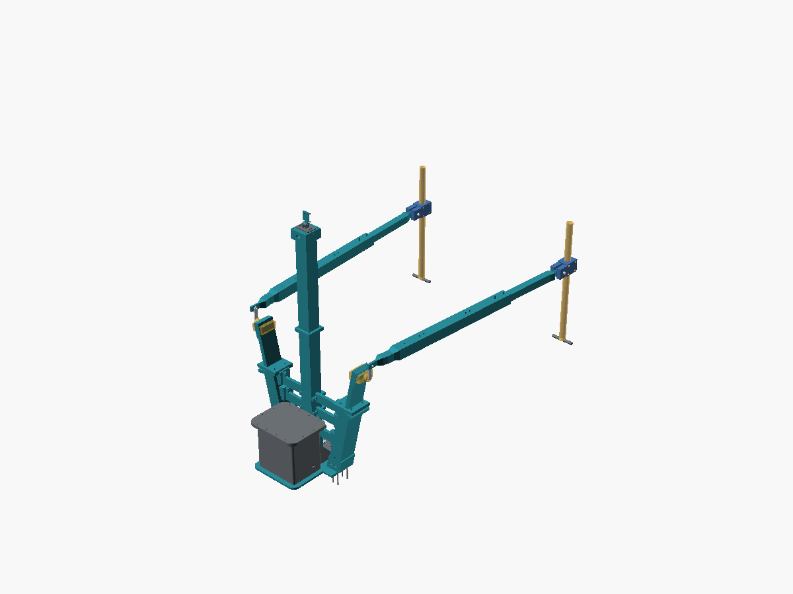

**Colour legend for every `view_*.png`:** teal = printed part · silver = steel hardware ·
grey = machine structure (schematic) · amber = reserved envelope or placeholder ·
red/yellow = E-stop mushroom · blue = removable cover / tray.

**The mower and hitch plate are not modeled.** Grey body and hitch-plate envelopes, lap bars and motor
positions are placeholders. The layer/arms/clamp/rods are CAD parts, but their relation to the mower is
illustrative until each hole, plate edge, bar diameter, motor shaft and neutral/PARK pin location is
measured on the actual machine.

Regenerate all views and parts with `python3 hardware/mounts/build_printables.py`.

---

## 0. Before touching the mower

- Engine off, key out, spark-plug lead off, battery negative disconnected, blade off, levers in PARK,
  wheels chocked, on level ground. Keep all tests unpowered.
- Identify mower serial/manual, determine whether the operator platform moves relative to the chassis,
  and locate both lap-bar pivots. If the seat/platform and pivots move relative to the arm-mounted
  servos, stop: this fixed-frame layout does not accommodate that motion.
- Measure the hitch hole, plate width/depth/thickness and surrounding edges, and each lap-bar tube
  OD. For the Toro 77502 rods, take the clamp-point, crank and travel measurements in
  `TORO_77502_LINKAGE.md`; the default rods are an estimate.

## 1. Coupons and machine measurements

| Coupon | Hold it against | Pass condition |
|---|---|---|
| `hitch_gauge` | Actual mower hitch bolt/hole | Mates without force; set enclosure `hitch_hole_d` from measurement |
| `arm_layer_gauge` | Enclosure tongue centre/auxiliary-hole pattern | All three holes align with the enclosure only; does not validate mower-plate anti-rotation |
| `fit_gauge_1` | E-stop rail and square U-bolt | Actual rail and bolt match the assumed window/pitch |
| `fit_gauge_2` | RDS51150SG stationary-holder side | Four M2.5 screws pass its 24 × 24 mm pattern |
| `lapbar_clamp_gauge_0`–`_2` | Actual steering-bar tube | Choose the coupon that slips over the measured OD without excessive looseness |
| `pushrod_gauge_0`–`_2` | 40 mm sleeve and 29.1 mm inner bar | Inner bar slides without binding at the chosen fit |

Measure the real hitch plate edges and edit `hitch_plate_width_mm`, depth and thickness in
`enclosure_common.scad` before printing the layer. Arm roots start 2 mm outboard of the schematic
plate edge; a wider plate may exceed the side-ear bolt land and intentionally fail the layer assert.
Measure each lap-bar clamp point and crank before changing `lapbar_pin_*`/`servo_crank_*`; never print
rods from the default estimate without that check.

---

## 2. Sandwich layer and outboard servo arms

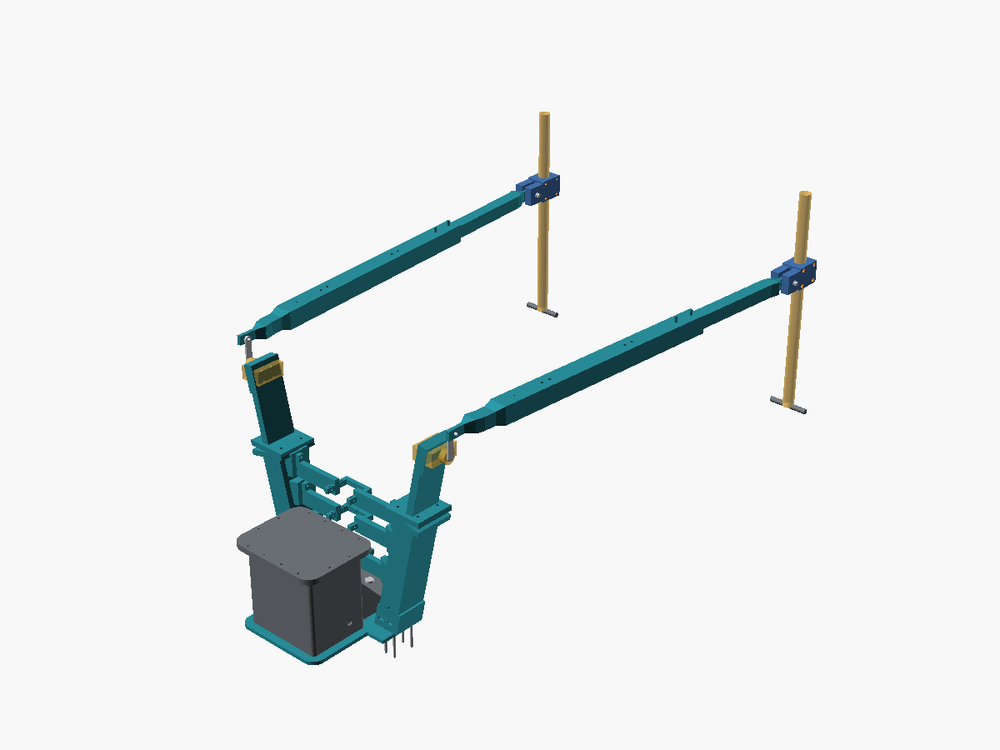
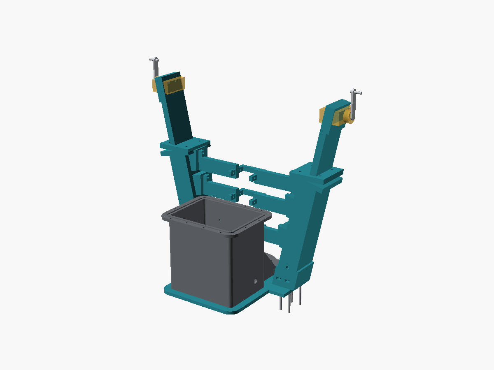

**Parts:** `arm_layer_center` × 1, `arm_layer_left/right` × 1 each, `arm_head_left/right` × 1 each,
`arm_brace_bar_left_0/1/2` and `arm_brace_bar_right_0/1/2` × 1 each, eight M6 root bolts/nuts and washers,
eight M6 head-joint bolts/nuts, twelve M5 pad bolts/nuts, twelve short M4 jaw screws/nuts,
eight M2.5 servo screws/nuts, plus the `hitch_gauge` and `arm_layer_gauge` coupons.

Each 60 × 70 mm solid root seats on the **top** of its sandwich-layer ear at z=0. Four
vertical M6 bolts enter from the free underside of the 8 mm ear and terminate in
side-entry captive nut slots in the root at z=16–22.5. The hollow 50 × 70 mm column
rises from that root, splayed 12.58° from vertical. Its two Ø8 side vents near
the root must remain open to both channel lobes, not sealed by paint or adhesive.
The measured servo face stays 209.55 mm from the ball-hole centre at z≈430 mm.
The lower arm's joint is at local t=355 mm; the head bolts to it through the
flanged, spigoted four-M6 lap. The holder face stays lateral.

**Sway bars are not steering-load parts.** Three per side land on arm pads at assembly
z=110/190/250 mm. The first fits beside the camera tower base webs below its joint;
the upper two fit above the first segment's bottom flange. Each handed bar has a
half-jaw; the left/right pair forms a rear-open U with a 0.4 mm centre gap, rather
than two full jaws occupying the same space. Fit from **+Y toward the box** after
tower assembly. Two short M4 screws per half thread into top-loaded steel nuts
and bear **outside** the tube, never through its USB-cable wall. Each pad has side-entry M5 nut
slots and two matching bar bores. The faces have 0.2 mm nominal print clearance;
clamp them squarely without forcing. Jaw slip, pad cracking or nut pullout is a
stop-work condition. No powered-steering strength qualification is implied.

Print each handed brace in its exported orientation. Its jaw touches the bed but
the broad web/end land sit above it: **supports are required under the raised web,
end land and jaw overhangs**. Do not stand the web upright to avoid supports; inspect
the slicer layers and keep all steel-nut entry slots clear.

The assembly images use a **160 × 120 × 8 mm schematic hitch plate**. Measure the actual hole,
plate outline and thickness first; set `hitch_hole_d`, `hitch_plate_width_mm`,
`hitch_plate_depth_mm` and `hitch_plate_t_mm` in `enclosure_common.scad`. The center
layer's 20.8 mm hole is provisional. Its 42 mm ears put the root bolt washers inside
the printable layer without moving the measured servo station.

1. Offer the tongue/layer/plate stack together with box, glands, tower feet and cables.
   Check the added 8 mm layer against actual fastener engagement and hitch hardware.
2. Align the center hitch hole. Reuse OEM hardware only if its thread, engagement,
   washer and rating permit the added thickness; do not invent a torque.
3. Slide four **steel M6 nuts per root** into the side slots, then place the feet on
   the layer **top**. Insert four M6 bolts per arm upward from beneath the side ears
   into those nuts; inspect all eight accessible seats and confirm no part enters
   the mower plate. Fit both heads, seating each spigot with four M6 flange bolts.
4. Assemble the camera tower first. Insert each pad's two M5 nuts from its +Y edge.
   Drop two M4 nuts into each half-jaw's top slots; use the labelled left/right
   STLs and offer both halves from **+Y** at z=110/190/250. Never slide over a flange.
   With the pad and bar parallel, pass two M5 bolts through the bar into the
   side-loaded pad nuts, then tighten the M4 screws only until the jaw is secure
   against the tube. Do not drill or enter the USB cable bore; hand-cycle and
   bench-load for slip and creep before any powered test.
5. Fit four M2.5 screws to each actual stationary servo holder. Keep the
   lateral output axis and full horn sweep unobstructed. The screws enter from the **arm's
   inboard side**: down the lower arm's channel, through a Ø4.8 driver tunnel in the head's rib,
   then the Ø2.9 bores in the 6 mm servo plate. Confirm the holder's four holes are concentric
   with its output before bolting: the mount is drilled with the pattern coaxial with the shaft
   (`servo_shaft_offset_l = 0`), and a holder whose screw pattern is off-axis needs either a new
   land or a measured offset — never a forced fit.
6. **Torque restraint remains a stop-work gate.** Auxiliary layer holes at x=±40
   are only candidate locations; the actual hitch plate has not been shown to
   match. One hitch bolt is not a positive anti-rotation path. Do not power the
   steering until an independently qualified restraint is fitted to the chassis.

## 3. Four-bolt lap-bar connectors

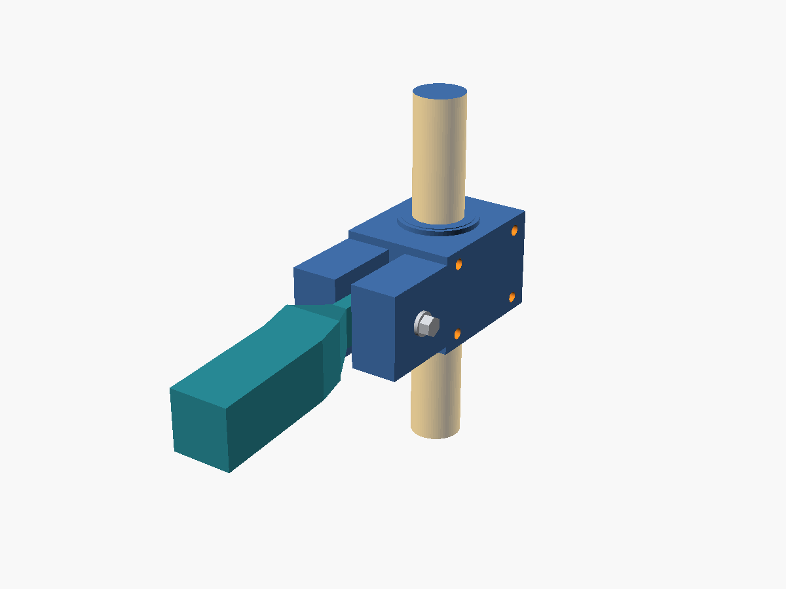

**Parts:** `lapbar_clamp_anchor` + `lapbar_clamp_cap` for each side, four M5 bolts with broad washers
and locking nuts per clamp, and one measured-OD coupon set (`lapbar_clamp_gauge_0`–`_2`). The 25.4 mm
default tube OD is sample-only. Set `clamp_tube_od_mm` and use the coupon before printing either half.
Each half carries one thick printed yoke ear. Together the ears straddle the rod's single 8 mm-thick
eye lug across a 9 mm gap; a removable M6 ×55 bolt passes through ear-eye-ear in double shear. The
42 mm yoke span/reach clears the 32 ×20 mm eye through its modeled planar sweep. The rod stays
8 ×20 mm through an 8 mm neck beyond the eye root, then tapers over 20 mm into the 29.1 mm inner
bar. That keeps the bar outside the ear envelope. Geometry only; not strength
qualification.

Position each clamp only after confirming it will not obstruct lever grip, pivot sweep, PARK, seat,
tyres, belts, lines or deck lift. Align the yoke pin axis to the rod eye; do not force a tilted pin into
place. Clamp preload, printed-material creep and bar-surface friction remain unqualified. Hand-test
slip and inspect for whitening/cracks before any powered test.

## 4. Positively locked rods

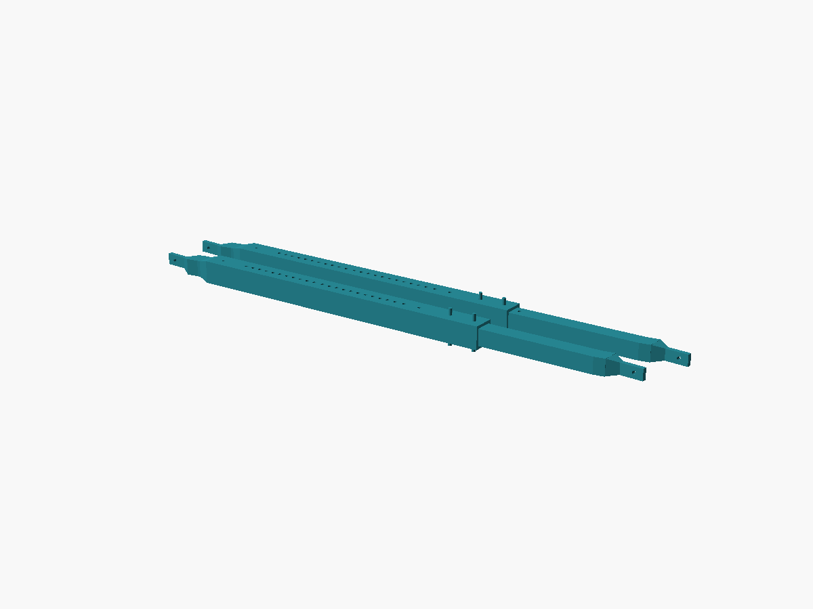

**Parts per side:** `pushrod_servo_end`, `pushrod_middle`, `pushrod_sleeve` and `pushrod_inner`
(print two sets; the left rod is the same set turned 180° about its own axis). Hardware per rod:
four M6 ×55 splice bolts, two M6 ×55 lock bolts, one M6 ×55 clamp-yoke pin, and one M6 ×25 crank
pin, each with washers and a locking nut. Verify actual stacks before ordering.
The 40 mm square tube has 5 mm walls; the 29.1 mm inner bar slides with 0.45 mm clearance per side.

The default **936.9 mm** pin length is the Toro TimeCutter MAX 50 in MyRIDE estimate in
`TORO_77502_LINKAGE.md`, not a measurement. The three lock settings give 921.9/936.9/951.9 mm.
Measure first, set the clamp-pin and crank values in `enclosure_common.scad`, then rebuild.

1. Select the loose/nominal/tight square-fit coupon. Join the three outer pieces spigot-first with
   two M6 bolts per splice. Both lock bolts must pass through the sleeve and the matching inner-bar
   holes at one setting. Friction alone is not the lock.
2. Fit the servo crank **up** at neutral, square to a level rod. Put the servo-end eye **outboard**
   of the metal arm with the 2.5 mm washer stack. Fit the inner eye between the clamp's paired yoke
   ears (9 mm gap). Both bores are Ø6.6 mm. Changing one lock step moves the servo eye 1.6 mm
   along its pin; correct it with washers.
3. Both pin axes must stay parallel to the mower's left-right axis. The rod's 4.54° skew carries the
   lap bar's extra outboard offset; it does not permit out-of-plane articulation. Do not bend the
   clamp, force a tilted pin, or use loose pins to hide a mismatch.
4. With servos unpowered, hand-cycle neutral, full forward, full reverse and outboard PARK. Remove a
   pin to verify manual release. Any binding, slip, interference or failure to self-centre is a
   stop-work condition; do not compensate with force.
5. While someone rides normally, check that the MyRIDE platform does not move the clamp pins
   fore-and-aft relative to the hitch plate. Such motion becomes an unintended lever command.
6. Route both rods clear of the engine, muffler, belts and seat platform. ASA must stay well away
   from exhaust heat.

The 12 V stall rating is 165 kg·cm (about 16.2 N·m): roughly 295 N at the 55 mm crank. That is a
hazard/load estimate, **not** a permitted operating force and not proof for any printed part or
mower mounting. No material fatigue/creep, impact, root-bolt, clamp-slip or hitch-plate
qualification is claimed.

## 5. E-stop

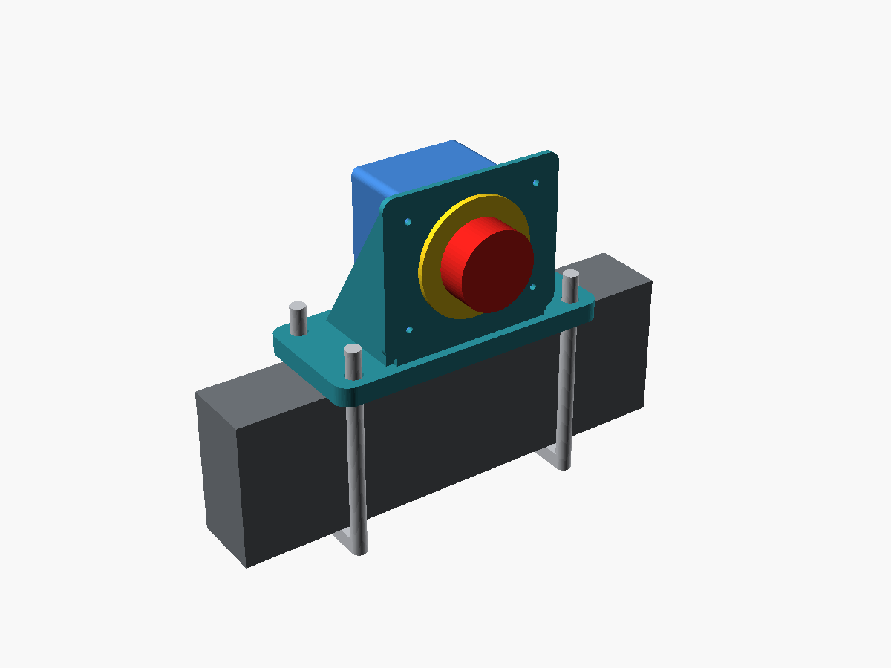
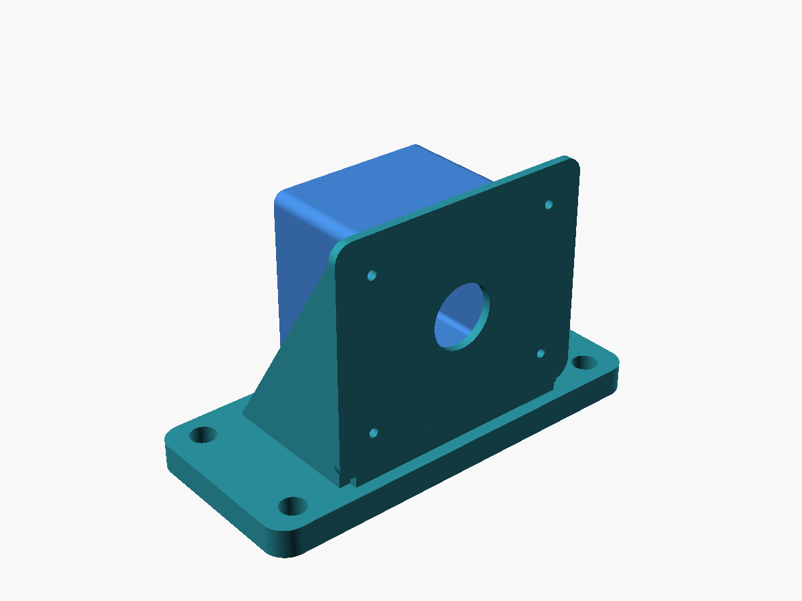

**Parts:** `estop_bracket`, `estop_contact_cover`, 2 square U-bolts + backing/washers/nuts, 4 M3 × 12 +
nuts + washers for the cover, the HB2-ES545 switch with its own retaining ring.

**Where:** on a frame rail at the **rear or side of the machine**, mushroom facing outward, at a height
you can hit with a palm **standing on the ground, without reaching over the deck or into the operator
station**. Not on the deck, not where knees or thrown debris hit it, not where you would lean on it to
climb on. Verify by walking up to the parked mower and hitting it without leaning in.

**Install:** switch through the Ø22.5 bore, retained by its own ring. Wire it. Four M3 nuts drop into
the cover's pockets from the open face; cover over the contacts, screws from the bracket side. Wire
opening faces **down**; tie the cable to the cover slots with a drip loop below. U-bolts as in step 2.
The cover keeps fingers and grass off the terminals; it is not a sealed housing.

## 6. Enclosure, sandwich layer and hitch plate

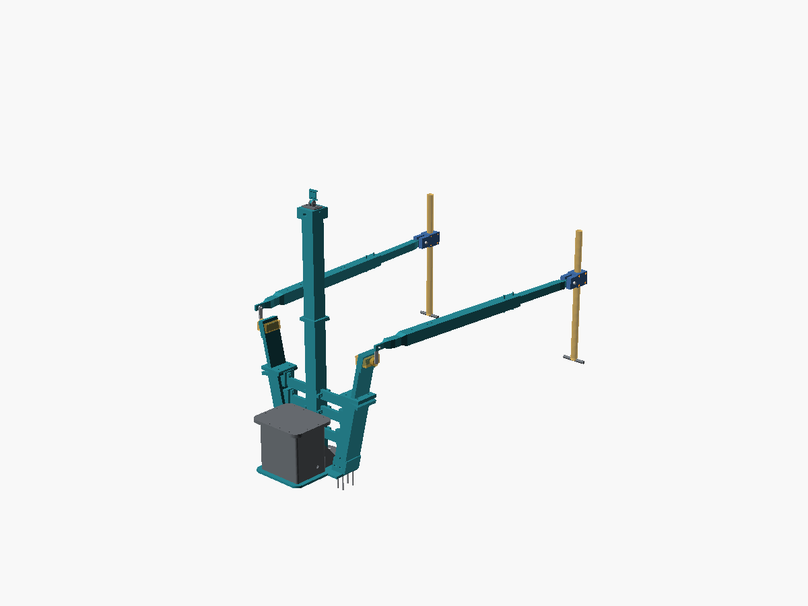
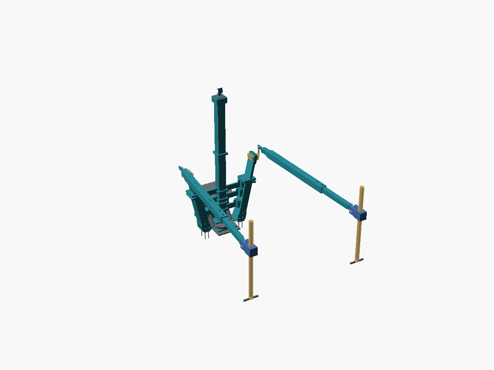
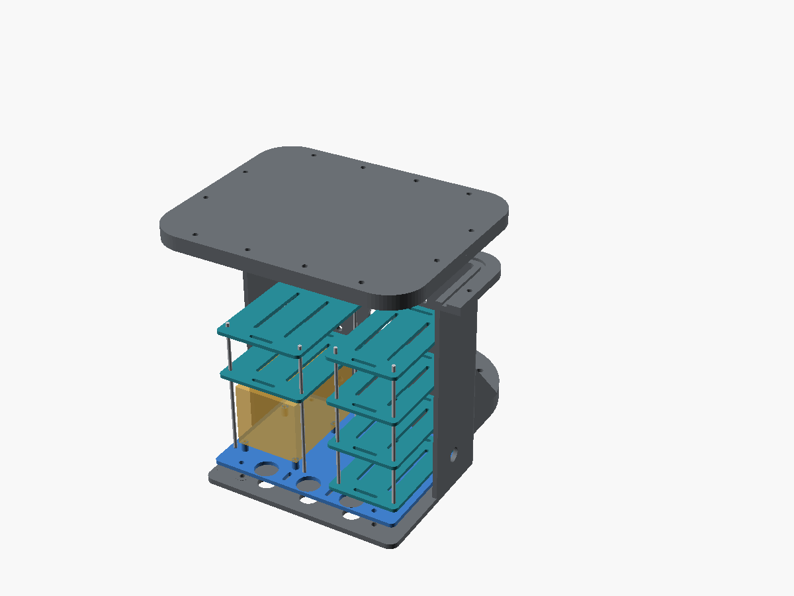

The box/tongue is held between the **measured mower hitch plate** and
`arm_layer_center`. The center panel has 42 mm ears with roots seated on top
and M6 bolts entering from the free underside. The hitch plate in the views
is schematic, not a Toro drawing. Complete §0/§1 measurements and §2 mock-up
before committing to a full box or powering steering.

**Stack and sequence:**

1. Fit glands/breather in the body; confirm their locknuts clear the layer's 24 mm pass-throughs.
2. Fit the electronics tray and seal its four floor bolts; choose bolts long enough for the added
   8 mm layer and check nut/thread engagement.
3. Fit the Pi, boards, insulating spacers and sleds. Drill only the actual PCB patterns.
4. Fit the camera-tower wall flange, backing strip and foot. Its M5 foot bolts also pass the layer;
   check their grip length with the extra 8 mm.
5. Fit the 3 mm seal cord, lid and twelve M4 fasteners.
6. Place the center layer under the box flange and integral tongue; align the ball-hole and auxiliary
   holes only if measured. Set the stack on the hitch plate and install correctly rated/length hardware
   using the mower's specified hitch-bolt torque.
7. Re-check the plate edges against the arm roots; verify a positive anti-rotation connection into
   the actual plate/chassis. The auxiliary tongue holes alone only join the box and printed adapter;
   if the plate has no matching holes, do not mistake them for torque restraint.

**Stop-work gate:** no positive hitch anti-rotation path is established in the model. The central
ball-hole fastener alone is not approved for powered steering or rough-ground use. Confirm ground,
reverse/trailer clearance, mounting strength, tower vibration, and all OEM interlocks on the actual
mower. A bridge across a suspended operator platform is not acceptable unless actuator and pivot
move together.

## 7. Camera tower

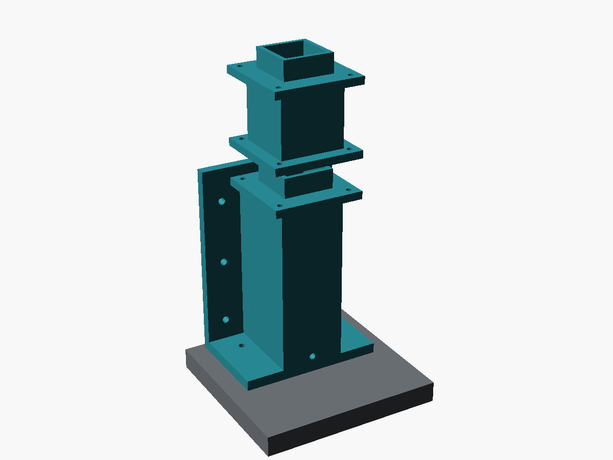
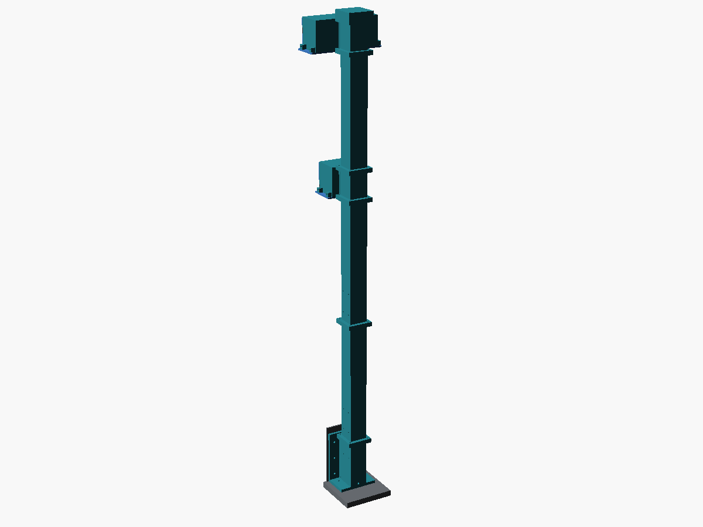

**Parts** (`camera_tower.scad`): `camera_tower_base`, `camera_tower_segment` × N (N and length derive
from `tower_height`; default 900 mm → 2 × 355 mm), `camera_tower_cap`, `camera_tower_backing`
(drilling template for a ≥2 mm metal strip inside the wall); 6 × M5 ×20 + nuts (wall), two M5 foot
bolts through foot, tongue and 8 mm sandwich layer (measure actual grip length; old 30 mm is no longer
a valid default), 4 × M4 ×16 + nuts per joint, 2 × M4 ×20 for the camera foot; `camera_foot` +
`camera_carrier`; a **USB** camera cable long enough for `tower_height` plus the run inside the box.

**Height first.** `tower_height` (tongue top to camera-foot surface) is a **900 mm placeholder**. Sit
on the mower, measure from the hitch plate top to where the lens must be to see over the seat back,
add the camera foot's own height, set it in `enclosure_common.scad`, rebuild. Segment count and length
update themselves; the assert refuses anything that will not lie on a 420 bed.

**Print orientation is structural.** The column's bending stress at the base is 3.7 MPa: FOS 11 along
the filament, **2.9 across layers**. Every column piece prints with its axis horizontal:

- `camera_tower_base`: the STL is already flange-down (wall plate on the bed, column lying, ~75 mm
  tall). Supports under the column and under its joint flange.
- `camera_tower_segment`: the STL is already lying flat on one tube face, 370 mm along the bed.
  No supports needed; the bore bridges 40 mm.
- `camera_tower_cap`, `camera_tower_backing`: flat, as exported.

Never stand a segment up to print it "cleaner" — that swaps the strong axis for the weak one.

**Install:**

1. With the box open: backing strip inside against the +Y wall, base flange outside, 6 × M5 through
   both; 2 × M5 down through the base foot into the tongue. Sealant around the cable port on the outside.
2. Feed the USB cable: plug end up through the base's column (in through the wall port), then through
   each segment and the cap **before** the camera foot is fitted — a USB plug will not pass a gland
   insert, which is why the port is a plain 24 mm hole to be sealed with a split grommet or sealant
   after the cable is in.
3. Drop the first segment's bottom flange over the base's spigot (0.4 mm clearance each side — it
   should slide, not need force); 4 × M4 through the flanges. Repeat for each segment.
4. Cap onto the last spigot, 4 × M4. Slide two M4 nuts into the cap's side slots, bolt the camera foot
   down through the roof; cable exits the cap's side slot toward the box, under the roof.
5. Camera carrier on the foot's pivot; set tilt; lock.
6. Any water that gets into the bore runs down to the base sump and out its small drain above the
   foot, below the wall port. Keep that drain clear.
7. If the column hums at engine speed, brace the first joint flange to the box lid flange with a strap
   or rod through the flange bolt holes. No FDM fatigue data exists for this; inspect the flange roots
   and the wall after the first season.

## 8. Camera, sensors, antenna

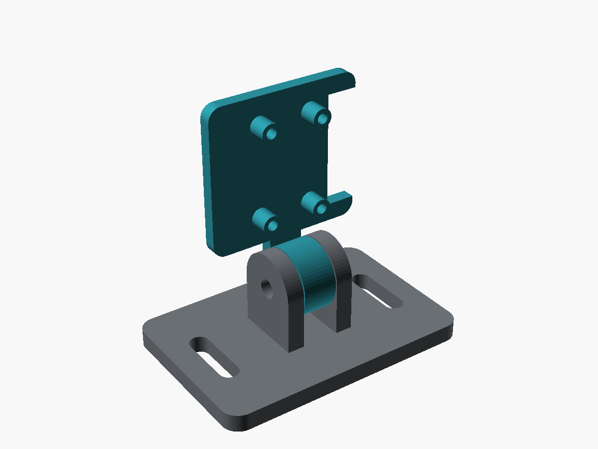
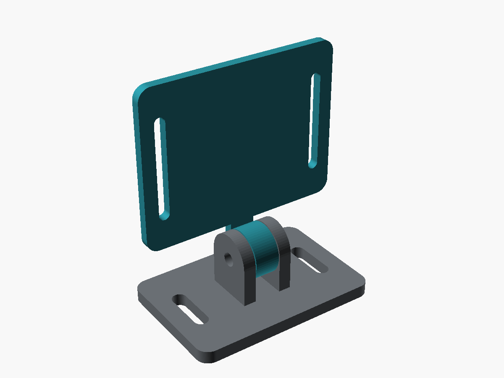

| Part | Where | Notes |
|---|---|---|
| `camera_foot` + `camera_carrier` | On the camera tower cap (step 7), looking forward over the seat back and slightly down | Two M4 × 20 through the cap roof into its side nut traps; M4 × 30 pivot with nyloc; set tilt, then lock. Route the USB cable down the tower bore. If a front-low view is also wanted, a second foot on a flat bracket at the front works the same way. |
| `sensor_carrier` (+ another `camera_foot`) | ToF: front corners, aimed forward, apertures unobstructed. BME280: shaded, ventilated, away from exhaust. IMU: rigid on the chassis near the middle of the machine, away from servos and high-current wiring. INA3221: inside the enclosure on a utility sled | Blank carrier: drill for the real board, board on insulating spacers, then fix the carrier |
| `antenna_deck` | Highest practical point with a clear sky view — behind/above the seat or on a mast | Strap the antenna through the edge slots; add a ≥100 mm metal ground plane under a patch antenna. Keep the RTK antenna away from the engine ignition lead |

## 9. Cables

- Every cable into the enclosure goes through a gland, from below, with a drip loop.
- `harness_saddle` every ~300 mm along the frame and at every change of direction; M4 into the frame,
  cable tie through the tunnel. No cable within reach of a tyre, belt, lever swing, or the muffler.
- `equipment_saddle` for the Bosch relay bodies and inline fuse holders: two ties per unit, mounted
  where they can be reached to swap a fuse.
- Servo power and signal run separately from GPS/camera cables. Servo power from the 12 V rail via the
  watchdog-cut relay — never through the PCA9685 V+ terminal.

## 10. Before the first powered test

Work through `docs/tractor-acceptance-criteria.md`. The items this package touches directly:

- Lever return-to-neutral with the linkage fitted, unpowered (item 10). Gate for everything else.
- OEM interlocks untouched: seat switch, PARK crank interlock, PTO (items in § Safety interlocks).
- E-stop reachable from the ground; cuts servo power and PTO.
- Servo travel calibrated so the horn never drives the lever past its mechanical stops.

Nothing in this folder certifies strength, weather sealing, or safety. It gets the parts in the right
place so those tests can be run.
